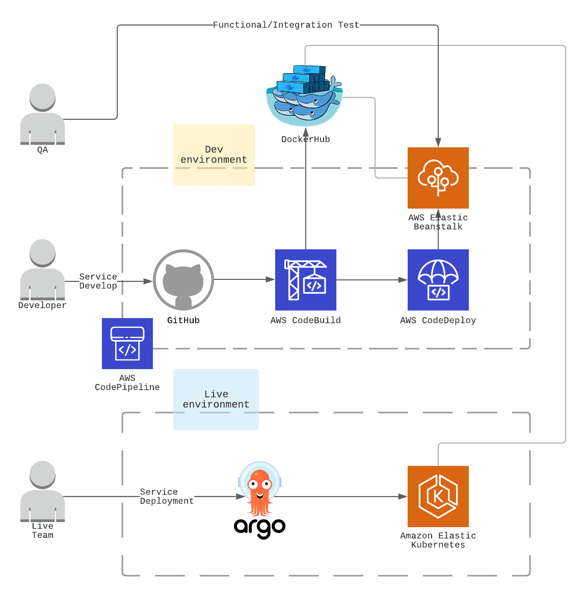

# DevOps - EKS with ArgoCD Pipeline

__EKS로 라이브 환경 구성 및 배포 환경 자동화 실습__

이전 실습에서 코드 빌드 및 테스트 환경을 구축 하였다면 이제 EKS로 상용 환경을 만들고 배포 관리툴(ArgoCD)을 설치해 관리 콘솔로 유연하게 서비스를 배포, 관리 하는 방법을 알아본다. 

## 사전 준비 사항
[CI Integration](../aws-codepipeline-eb/README.md)

## 구성 하기


### Install eksctl and kubectl
https://docs.aws.amazon.com/eks/latest/userguide/getting-started-eksctl.html

### Deploy EKS Cluster

https://docs.aws.amazon.com/eks/latest/userguide/getting-started-eksctl.html

```
eksctl create cluster \
--name kc-devops-05 \
--version 1.18 \
--region ap-northeast-2 \
--nodegroup-name linux-nodes \
--nodes 1 \
--nodes-min 1 \
--nodes-max 3 \
--with-oidc \
--ssh-access \
--ssh-public-key kc-seoul-devops \
--managed \
--alb-ingress-access
```

```
---
apiVersion: eksctl.io/v1alpha5
kind: ClusterConfig

metadata:
  name: devops-eks-demo
  region: ap-northeast-2

availabilityZones: ["ap-northeast-2a", "ap-northeast-2c"]
managedNodeGroups:
- name: gitops-workers
  desiredCapacity: 1
  iam:
    withAddonPolicies:
      albIngress: true
  ssh:
    publicKeyName: "kc-seoul-devops"

cloudWatch:
    clusterLogging:
        enableTypes: ["audit", "authenticator", "controllerManager"]

```
